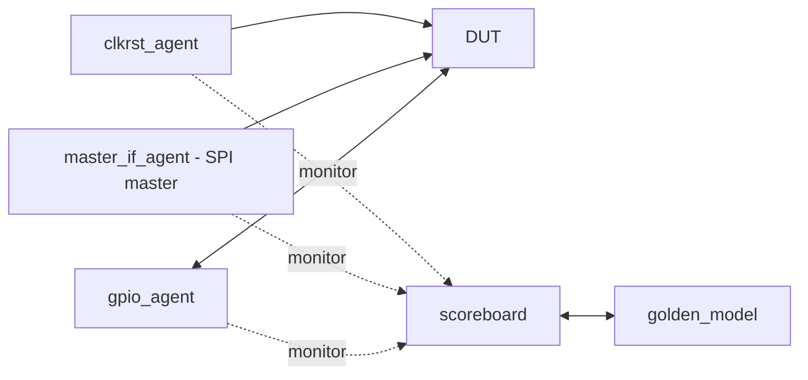

# Engine Verification Test Plan

## Purpose and status

This document defines the planned verification environment for the programmable I/O (PIO) engine. The current RTL is still the Tiny Tapeout adder example, so the agents, golden model, and scoreboard described here are a plan, not implemented components. The PIO instruction behavior is specified in [docs/info.md](../../docs/info.md); that ISA document and this plan must be updated together when behavior changes.

The testbench will use Cocotb and Python. It will verify the core through its external programming interface and GPIO pins, without requiring tests to depend on internal RTL state. Optional internal probes may help debug failures but must not be required for a passing test.

## Directory layout

```text
test/
|-- doc/
|   `-- engine_testplan.md
|-- harness/
|-- hvp/
|-- model/
|-- scripts/
|-- tb/
`-- utilities/
```

- `harness/`: environment assembly, agents, monitors, and scoreboard.
- `hvp/`: reusable high-level verification scenarios and protocol sequences.
- `model/`: ISA decoder/encoder and cycle-accurate golden model.
- `scripts/`: regression, lint, and report entry points.
- `tb/`: Cocotb test modules and test configuration.
- `utilities/`: shared helpers, trace formatting, and deterministic random seeds.

Starter modules live alongside this plan: agents and the scoreboard in `harness/`, the ISA and golden model in `model/`, scenario templates in `hvp/`, a Cocotb entry-point template in `tb/`, and shared event definitions in `utilities/`. These files intentionally contain TODOs where the RTL or host-interface contract is not defined yet.

## Testbench architecture



Each active agent drives only its own interface and has a passive monitor that observes the resulting pin-level activity. Monitors publish timestamped or cycle-indexed events; they do not contain expected-value logic. The scoreboard collects those events, advances the golden model in lockstep with the DUT clock, and compares expected and observed externally visible behavior.

### Components

| Component | Responsibility |
| --- | --- |
| `clkrst_agent.py` | Generate the test clock and apply reset. The implementation will use the user-provided code when available. Its monitor reports clock/reset state and reset release to the environment. |
| `master_if_agent` | Act as the programming-interface SPI master: drive transactions that configure or load the PIO program. A monitor decodes completed transactions and publishes them to the scoreboard/model. |
| `gpio_agent` | Drive external GPIO input levels, release pins when appropriate, and record output values and output-enable changes. A monitor samples resolved pin values and DUT drive enables on clock edges. |
| `golden_model` | Independently execute the documented ISA and model architecturally visible state and pin behavior. It consumes the same reset, program-load, and GPIO-input events as the DUT. |
| `scoreboard` | Correlate monitor events by cycle, update/check the reference model, and report the first mismatch with instruction address, expected value, observed value, and recent event history. |

The model must not read DUT internal registers or derive its answer from DUT outputs. Program writes are applied to both the DUT and model from observed SPI transactions, so the reference follows what was actually delivered on the interface rather than what the test intended to send.

## Golden model

The initial model is a small Python reference interpreter, not a second RTL implementation. It models only architectural state and cycle effects:

- byte-addressed `PC` and the program bytes received through the host interface;
- accumulator `A`, loop counter `X`, output latch, and pin direction mask;
- opcode fetch and optional extension-byte fetch, following the instruction lengths in the ISA;
- pin sampling, pin writes, `WAIT` stalls, `DELAY` cycles, and branch decisions;
- reset state and the order in which input sampling and output changes occur relative to a clock edge.

Each model step represents one active DUT clock edge. The model emits expected pin value and output-enable mask for that cycle. Tests compare those predictions against the GPIO monitor. The model should also expose a concise trace (cycle, `PC`, decoded instruction, state changes, expected pins) for failure diagnosis, while architectural internals remain reference-only and are not compared directly to DUT internals.

ISA edge cases must be made explicit in the model and tests before RTL sign-off: reset during a partially received SPI command, invalid/reserved opcodes, address wrap/end-of-program behavior, `WAIT` condition becoming true on an edge, and the exact timing of extension-byte reads and `DELAY`. The testplan does not invent answers where the ISA or RTL interface has not yet defined them; those contracts are open items below.

## Scoreboard and event flow

1. The test sequence requests reset, program loading, and GPIO input changes through the relevant agents.
2. Agent monitors publish what happened at the pins, indexed to the active clock cycle.
3. The scoreboard applies reset, observed program writes, and sampled GPIO inputs to the golden model in the same order as the DUT sees them.
4. The model predicts GPIO output value and output-enable mask for that cycle.
5. The scoreboard compares expected and observed values, allowing only explicitly specified propagation/sample timing; mismatches fail at the earliest cycle.

Comparisons should mask pins configured as inputs for the output-value check, but must always check output-enable behavior. GPIO input checking should account for released pins and any pull-up behavior defined by the eventual harness. Every failure should include the cycle and a short, bounded history rather than dumping an unbounded trace.

## Test plan

### Directed bring-up

- Reset puts the core into its documented initial state and leaves GPIO pins as inputs.
- SPI host can load a short program and read/write behavior matches the eventual host-interface contract.
- `SET DIR`, `SET PINS`, and `MOV PINS, A` drive the selected pins and release the others.
- `MOV A, PINS` samples externally driven levels.
- `WAIT` holds execution until the selected pin reaches the requested level.
- `DELAY` stalls for the documented number of cycles.
- `JMP`, `JNZ`, and `LOOP` take and do not take branches at their boundary conditions.
- Immediate arithmetic, shifts, and zero/nonzero accumulator cases match the ISA.

### Interaction and protocol examples

- Exercise pin-level UART transmit/receive timing using short programs.
- Exercise SPI mode-0 transfers and open-drain-style I2C release/drive-low sequences where supported by the GPIO electrical model.
- Verify back-to-back program instructions and interleaving waits, GPIO transitions, and branches.
- Reset while idle, while waiting on GPIO, and during host programming once reset/host behavior is specified.

Protocol tests demonstrate that firmware can create these waveforms; they do not replace instruction-level tests. Keep protocol vectors small and derive exact expected edges from the program and configured clock period.

### Randomized and regression testing

After directed tests pass, generate bounded random programs from legal instructions, along with randomized GPIO transitions and host programming sequences. Use a fixed seed by default and print the seed on failure. Constrain branch targets to valid opcode boundaries and avoid unsupported/reserved encodings until their behavior is defined. Track coverage for each opcode, branch outcome, wait completion/stall, pin direction, and representative instruction interactions.

## Open interface decisions

These are prerequisites for a fully executable testbench and must be agreed with the RTL design:

- SPI host pinout, mode, command framing, program-memory capacity, and whether reads/status are supported.
- Whether the program is written while the core is held in reset, halted, or running.
- Clock and reset polarity/timing as seen by the testbench, plus reset effects on program memory.
- Exact `PC` behavior at program-memory end and for invalid opcodes/branch targets.
- GPIO electrical resolution, especially whether input pins have modeled pull-ups and how open-drain operation is represented.
- Exact cycle-boundary ordering for pin sampling, output updates, and a `WAIT` that becomes true on the current edge.

Until these are defined, SPI and corner-case tests should be marked pending rather than encoding guessed behavior in the golden model.

## Entry points and acceptance criteria

The existing `test/Makefile` and `test/test.py` exercise the adder example and are not yet wired to this planned environment. Keep the PIO verification runner separate until the PIO RTL and its SPI contract exist; then add it to the normal test flow without silently replacing the existing template test.

The PIO block is ready for verification sign-off when the directed ISA suite passes, the scoreboard checks value and direction on every relevant cycle, reset and host loading behavior are defined and tested, randomized legal-program regressions are repeatable, and all planned opcode/branch/wait coverage points have been hit or explicitly waived.
